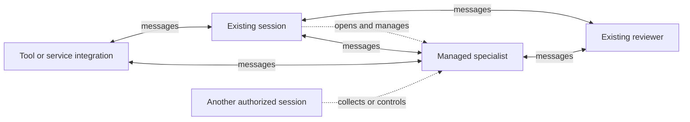

# Sessionbus

**Let your sessions and tools work together, on one machine or across hosts.**

Two independently started sessions can ask each other questions, exchange findings
and receive corrections during work where their native products support it. They
keep their own tools and context. You do not have to relay every exchange between
terminals.

Sessionbus is an open protocol and a user-run session bus. It supplies discovery,
addressed messaging and optional managed-session controls. Two sessions of the
same product use the same bus as sessions from different products; a participant
can also be a tool or another program implementing the protocol.

## What can you do with it?

- **Connect colleagues you already have.** Start sessions in a shared group
  (`-g team`) so they can discover and message one another. No parent or central
  AI coordinator is required.
- **Bring in a specialist and keep it involved.** Open a managed native session,
  or *lane*, locally or on another host. It can consult other visible peers,
  receive new evidence and continue through follow-up Runs in its native context.
  Choose how idle messages, owner exit, notifications and retirement work.
- **Let programs participate.** A script can coordinate sessions; a tool or
  service can implement a resident peer or a managed Worker. Public Go and
  JavaScript SDKs and a non-model reference Worker are provided. Each external
  service still needs an integration.
- **Keep your orchestration.** Use the bus underneath your framework or alongside
  native teams and subagents. Your system decides the workflow; the bus supplies
  communication and session controls where you need them.

These uses can coexist. A managed specialist can ask an independently started
reviewer for clarification instead of only returning an answer to its launcher.
Communication is also what makes richer managed-session use possible: the work
can change through questions and new evidence, and the conversation can continue
through multiple Runs.



This is a relationship diagram, not a mandatory coordinator or scheduler.
Participants can be local or on federated hosts. Groups govern visibility and
ordinary control; lifetime ownership and live parent tracing have separate
rules. A lane joins its parent's private group, not every group the parent
belongs to. Native subagents become separately addressable only where their
integration connects them.

**Limits:** no durable offline inbox or automatic replay; a delivery receipt is
not proof of consumption. Native products keep their transcripts and permissions;
live Workers hold unacknowledged results. Optional communication logs are bounded
diagnostics, not a delivery store. Deployment assumes a trusted user/host
network; federation uses TLS, and the hub can read routed messages.

[Start with two sessions](QUICKSTART.md) ·
[Scenarios, concepts and FAQ](docs/USAGE.md) ·
[Protocol reference](bus/docs/PROTOCOL.md)

## See it working

The [92-second native terminal demo](https://x.com/iamantst/status/2100973895377371533)
shows Codex, Claude Code and Grok on three hosts exchanging a review and tests.
The Codex session runs the tests, then opens remote Claude and Grok lanes and
collects their results through the shared contract. Waiting intervals are cut.

This is one use of the bus, not a coding benchmark or its full scope. The same
contract also connects sessions of the same product, with no parent relationship.

Six established adapters cover Claude Code, Codex, Grok, Qwen, OpenCode and Kilo;
Pi and OMP are two additional preview integrations. DSH integration has a
separate, ongoing release path. Native products, authentication and permissions
remain prerequisites. See [sessionbus-peers](https://github.com/antst/sessionbus-peers)
for installers and per-product limits.

This repository contains the `sessionbus` daemon, `sessionbus-hub` federation
router, `sessionbus-call` reference caller, `example-peer` Worker and public SDKs.
A hub is optional for local use and required for the current cross-host path.

## Install binaries

Install the normal host (daemon, reference caller and example worker; no hub):

```sh
curl -fsSL https://raw.githubusercontent.com/antst/sessionbus/main/deploy/install-host.sh | sh
```

Install only the federation hub:

```sh
curl -fsSL https://raw.githubusercontent.com/antst/sessionbus/main/deploy/install-hub.sh | sh
```

Linux and macOS, amd64 and arm64 are supported. Run as your normal login user;
no sudo, Go, npm, or checkout is required. The scripts verify release SHA256
checksums and install under `~/.local`, using systemd user services on Linux or
launchd on macOS. Linux needs a working user service manager. Only the selected
role is restarted. Add `~/.local/bin` to your login PATH if prompted. Existing
configuration, keys, state and the other role are preserved. An earlier real
`current` directory is retained under `releases/prior.*/current` when migrating
to the release symlink. Product peers
install separately from [sessionbus-peers](https://github.com/antst/sessionbus-peers).

The default is GitHub's **latest stable release** (`SESSIONBUS_VERSION=latest`),
using its `/releases/latest/download/` endpoint. Prereleases are not selected.
To pin a published version, set the variable on **sh**, not curl:

```sh
curl -fsSL https://raw.githubusercontent.com/antst/sessionbus/main/deploy/install-host.sh | SESSIONBUS_VERSION=vX.Y.Z sh
```

Replace `vX.Y.Z` with an actual [release tag](https://github.com/antst/sessionbus/releases).
Development builds are opt-in: use `SESSIONBUS_VERSION=development sh` in the
same pipeline. The rolling development prerelease follows tested `develop`
builds and can change between installations.
See the [v0.5.4 release notes](docs/releases/v0.5.4.md) for tracing and communication logging,
and [v0.5.1](docs/releases/v0.5.1.md) for federation upgrade order.
`SESSIONBUS_DOWNLOAD_ROOT` can select a mirror containing the same archives and
`SHA256SUMS`. Missing releases or checksum failures stop before installation.
You can download and inspect the script before executing it.

## See what is running

```sh
sessionbus roster
sessionbus roster --json
sessionbus roster --local
sessionbus roster --all
```

`roster` is the daemon owner's operational view of **all groups**. By default it
shows online peers and lanes, plus any lane with an active Run
(`connected || running`).
Use `--all` to include offline and retained/archived entries. This filter applies
to both table and JSON output, on local and remote hosts. Rows include product,
name, session ID, groups,
connected/running state, lane owner, persistence, and requested lane permission
mode. Federated hosts contribute the same live metadata. It does not expose
messages, results, native arguments, arbitrary peer `info`, credentials, or
ownership tokens, and it does not register an observer peer.

The operator socket is mode 0600 inside the current user's mode-0700 runtime
directory. This is same-user diagnostic access; ordinary `session.list` calls
remain group-restricted. Authenticated federation hosts are trusted to request
each other's operator metadata. `roster --socket PATH` selects the daemon using
its **public** socket path; the operator endpoint is derived automatically.

`--json` emits `sessionbus.roster.v1`. Unavailable remote metadata is marked
explicitly and the command exits nonzero for an incomplete roster; `--local`
skips federation. Upgrade the hub and hosts to v0.5.1 for complete federated
rosters. Older links continue working and are never sent unsupported roster
requests. No native permission mode is inferred for a peer that does not have
a daemon-owned lane Open record.

For caller-scoped protocol access, the reference caller remains available:

```sh
sessionbus-call -g YOUR_GROUP session.list '{}'
```

Use `sessionbus --help`, `sessionbus help roster`, `sessionbus help secret`,
`sessionbus-hub --help`, or `sessionbus-hub add-host --help` for the actual CLI
commands and flags. These help commands do not start services or alter keys.

### Configure advertised products

Edit `${XDG_CONFIG_HOME:-$HOME/.config}/sessionbus/service.env`. New host
installations include all nine integration commands:

```sh
SESSIONBUS_PRODUCTS=claude-peer,codex-peer,grok-peer,kilo-peer,omp-peer,opencode-peer,pi-peer,qwen-peer,dashi
```

Keep the commands you intend to offer on this host. Install the corresponding
products separately and make them available on the daemon service's `PATH`.
`dashi` is the DSH integration's product command; its launch token selects the
`sessionbus` lane profile. Plain `dsh` is not a substitute for that launcher.

Restart with `systemctl --user restart sessionbus` on Linux, or
`launchctl kickstart -k gui/$(id -u)/net.antst.sessionbus` on macOS.
Reinstallation preserves an existing `service.env` unchanged, so existing
installations must add this setting explicitly. Environment support requires
this updated daemon; v0.5.2 only accepts the `-products` flag.

For a foreground daemon, use `sessionbus -products codex-peer,claude-peer`.
The flag overrides `SESSIONBUS_PRODUCTS`; `-products ''` or an empty environment
value advertises no configured products. Use comma-separated executable names
without spaces. The daemon rejects invalid or duplicate names.

This list is discovery metadata, not a launch allowlist or an installation
check. It does not grant peer visibility: ordinary session lists remain
restricted by groups. Lane requests resolve the requested executable on the
service `PATH` even if it is not advertised.

### Parent-controlled child tracing

Tracing defaults to **off**. A parent can select `"trace":"events"` or
`"trace":"content"` in the Sessionbus tool's `spawn` arguments, for a fresh or
resumed lane. `events` includes message identities and delivery outcomes;
`content` also includes the message body. To change a child's mode while it runs:

```json
{"action":"trace","arguments":{"session_id":"child-id@host","mode":"content"}}
```

Use `"mode":"off"` to stop tracing. Only the child's live parent can configure
it; sharing a group or reusing an old parent's session ID does not grant access.
This also works for persistent children, but the tracing relationship itself
does not survive its parent ending or a daemon restart. Resume under the new
parent to establish a new relationship; no previous tracing policy is restored.

After the original send settles, its originating daemon sends one ordinary
message to each eligible parent. If two children of the same parent communicate,
that parent gets one copy, including both `matched_children` and their delivery
results. The copy has a new message ID; its JSON body has `kind: sessionbus.trace`,
the original `message_id`, `from`, permitted recipients/results, and an optional
`body`. It is a daemon report, not a request from the original sender. Do not
reply to its generated daemon identity. Copies and their completion pointers
do not generate more copies.

Normal parent delivery policy applies: an idle-run parent can start a Run,
while a staging parent receives the message for a later turn. Copy delivery
never holds up the original result. Copies are best-effort, memory-bounded and
not retried; an unconfirmed copy may nevertheless have reached its recipient.
Original `written` or `no_receipt` outcomes keep their existing meanings and do
not prove native consumption.

`off` prevents subsequent admissions; it does not recall original sends already
admitted with a trace snapshot, so a copy may still arrive after `off`, including
from remote origins. Local child snapshots are discarded if their policy changes
before emission. Snapshots are never upgraded, and a copy is refused at arrival
if its parent's lifetime has ended.

There is **no new persistence**: no trace history, read API, replay, disk queue,
or changes to durable lane rows. Normal native transcripts may retain delivered
messages as usual. Tracing works with communication logging disabled. Updated
daemons, hub and SDK/tool declarations are required for remote tracing; older
hosts continue ordinary messaging. See the [tracing design](docs/designs/COMMUNICATION-TRACE.md)
for the scope and compatibility contract.

### Communication logs

Communication logging is **off by default**. To enable it, edit
`${XDG_CONFIG_HOME:-$HOME/.config}/sessionbus/service.env` and restart the daemon:

```sh
SESSIONBUS_COMMS_LOG=metadata   # off | metadata | content
# SESSIONBUS_COMMS_LOG_DIR=/absolute/private/directory
```

`metadata` records message routing and receipts, lane requests and Run state
transitions. `content` additionally records message text. Native prompts, Run
result bodies, arbitrary peer info, arguments, credentials and authorization
tokens are not logged. The installer preserves an existing `service.env`.

The daemon writes one structured JSONL stream at
`${XDG_STATE_HOME:-$HOME/.local/state}/sessionbus/comms/sessionbus.jsonl`.
Each record has UTC time, a daemon incarnation and sequence number. Message
records identify `from` and `to` with canonical session IDs including `@host`,
plus names and products when known. The send header retains the requested target,
targets or group; separate dispatch and receipt records identify each resolved
recipient by `message_id` and `delivery_id`. An unresolved target stays a requested
selector, with its rejection reason; no recipient identity is invented. Rejection
before dispatch produces a receipt without a delivery ID; an admitted delivery
that loses its receipt retains its delivery ID and reports `no_receipt`. A
multi-target send stores its body once per observing host, not once per recipient.
Federated observations on different hosts correlate by the same message ID.

Defaults retain four files of up to 16 MiB each, including the current file.
Files are private (0600), in a private directory (0700). The daemon flags
`-comms-log-max-bytes`, `-comms-log-files` and `-comms-log-queue-bytes` control
bounds. Optional `-comms-log-sessions` and `-comms-log-groups` select events without
creating duplicate group/session files. Filters match known endpoint identities
and groups at each observation. A recipient-only filter can retain dispatch and
receipt rows while omitting the earlier header whose recipient was not yet
resolved. Leave filters unset to retain complete send headers and message text.

Logging never waits for disk writes in a routing loop. Queue pressure produces
gap records; a disk error stops logging and reports a diagnostic on stderr.
Shutdown joins the writer. Retention, a crash or a disk failure can lose records;
this is diagnostic logging, not proof that every communication was retained.
Logging does not enable parent tracing or deliver messages to a parent. The
[child tracing](#parent-controlled-child-tracing) is separate.

### Connect hosts to a hub

Host installation generates `~/.config/sessionbus/host.key` once (mode 0600).
This is a **shared join secret**, not a public key. Reinstallation preserves it;
the installer never prints it. Transfer it securely to the hub administrator.
The hub starts with an empty mode-0600 `~/.config/sessionbus/hub.json` host map.
On the hub:

```sh
chmod 600 /path/to/copied-host.key
sessionbus-hub add-host -secret-file /path/to/copied-host.key workstation
systemctl --user restart sessionbus-hub
```

On the host, add or update these entries in `~/.config/sessionbus/service.env`,
preserving other settings:

```sh
SESSIONBUS_HOST=workstation
SESSIONBUS_HUB=hub.example:7419
SESSIONBUS_HUB_SECRET_FILE="/home/YOUR_USER/.config/sessionbus/host.key"
```

Use the actual absolute key path printed by the installer. Restart the host
with `systemctl --user restart sessionbus`. On macOS use
`launchctl kickstart -k gui/$(id -u)/net.antst.sessionbus` (append `-hub` for the
hub). Allow TCP 7419 through the hub firewall as appropriate. Host names must
match the registration. `add-host` is idempotent for the same name/key, rejects
implicit key replacement and duplicate secrets, and edits configuration only;
restart the hub to load it. `SESSIONBUS_HUB_LISTEN` in `hub.env` changes the
listener. `XDG_CONFIG_HOME` changes the installer and `add-host` default configuration location.

The host daemon reconnects automatically when the hub returns, using bounded
backoff. Local peers and local operations remain available while the hub is
unreachable, including at daemon startup. A hub restart does not require
restarting host daemons. Configuration errors such as an invalid address or
malformed secret still prevent startup. Operations interrupted by a lost hub
connection fail without replay; a lost message receipt is reported as
`no_receipt`, so do not assume the remote action did not execute. Remote
Worker ownership ends with the lost connection and is not restored by reconnect.
Use `sessionbus roster --local` to inspect local peers during a hub outage;
the default roster reports incomplete federation until recovery.

The host installer waits at most ten seconds for an authenticated local list response.
Hub installation reports service activation only; inspect the service status/logs
to confirm its listener. Preserved `hub.env` can override its default port and host map.

### Build or publish releases

`deploy/package-release OUTPUT_DIRECTORY` builds separate host/hub archives;
set `GOOS`/`GOARCH` to cross-compile. The `Binary releases` workflow publishes
development artifacts from `develop` pushes after its tests and builds pass. Maintainers publish an immutable stable release by pushing a new `vX.Y.Z`
tag pointing at reviewed source. `SOURCE.txt` records the
commit; archives contain the revision and license. Stable tags are never
overwritten. Tag-triggered release builds also run the repository tests.

## SDKs and development

The Go SDK is the independent module
`github.com/antst/sessionbus/bus/sdk/go`; the JavaScript SDK is published as
`@sessionbus/kit`. The daemon is GPL-3.0-only under the root [LICENSE](LICENSE).
The Go and JavaScript SDKs are MIT-licensed under
[`bus/sdk/go/LICENSE`](bus/sdk/go/LICENSE) and
[`bus/sdk/js/LICENSE`](bus/sdk/js/LICENSE).

Go connection owners can use `NewConnection(fd, handler)` with an already
connected `net.Conn`. The public `Connection` and `Request` aliases expose the
existing validated duplex RPC implementation, including `Call`, `CallObserved`,
`Begin`, `Result`, and `Error`. The owner controls registration and connection
lifetime; there is no automatic reconnect. The non-nil handler and
`CallObserved` callback run on the reader in frame order, so they must offload
blocking work. `CallObserved` observes a valid decoded result before the next
inbound frame is dispatched. `Close` closes the socket and cancels its context.

Caller waits are cancellable: JavaScript `caller.wait(request, signal)` and
`caller.action("wait", request, signal)` accept an `AbortSignal`; Go provides
`caller.WaitContext(ctx, request)` and forwards the context from `Action`.
Cancellation stops only that wait and preserves the run/result handle for a
later status or wait call. It does not interrupt the native run. Existing Go
`Wait(request)` remains available without cancellation.

List replies include `self_info` with the bound caller's canonical `session_id`,
optional `name`, `product`, and `groups`, even when filters select other sessions
or hosts. Compare `self_info.session_id` with row IDs to identify self. Go exposes
it as `SessionListResult.SelfInfo`; JavaScript preserves the wire `self_info`
object. Updated SDKs accept omission from older daemons (Go: `nil`), which means
the response does not identify self. Upgrade clients before the daemon: earlier
SDKs reject this new response field.

Run the repository gates with:

```sh
go test -race ./...
go vet ./...
(cd bus/sdk/go && GOWORK=off go test -race ./... && GOWORK=off go vet ./...)
npm test --prefix bus
```

Product peers live in [antst/sessionbus-peers](https://github.com/antst/sessionbus-peers).
The signed designs are in [`docs/designs`](docs/designs), and the generated
wire reference is [`bus/docs/PROTOCOL.md`](bus/docs/PROTOCOL.md). The longer
direction is described in [`docs/END-GOAL.md`](docs/END-GOAL.md).

Pre-split history remains on the `legacy-*` branches of Forgejo repository
`ai/sessionbus`.
