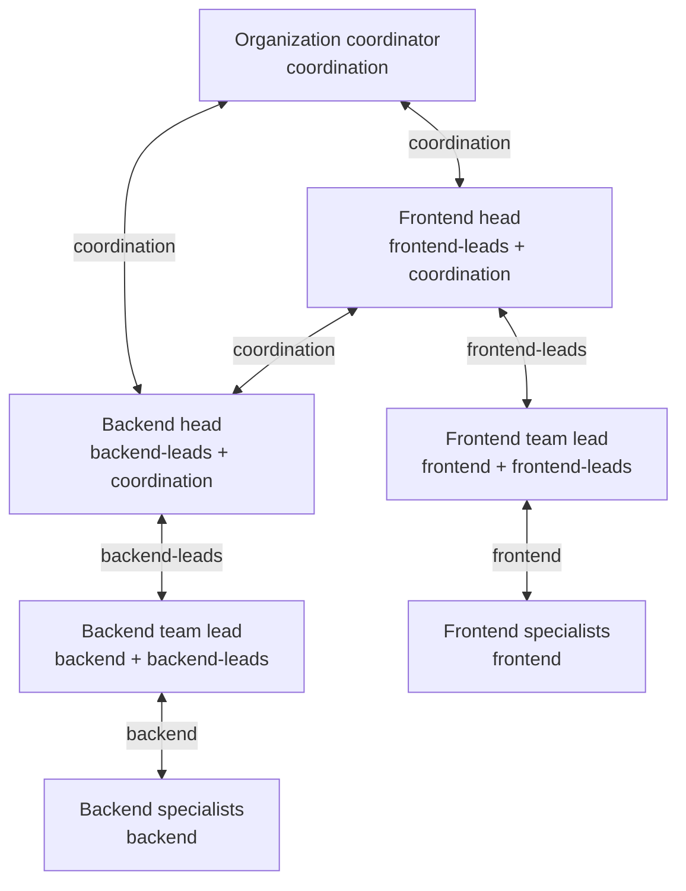

# Sessions working together

Sessionbus lets independently running sessions and programs discover one another
and exchange messages. When you need to open and manage another session, it joins
that same communication network. Existing orchestration and native subagents can
continue alongside it.

Start with the [two-session quickstart](../QUICKSTART.md). This page explains the
relationships and choices behind more involved uses; the
[protocol reference](../bus/docs/PROTOCOL.md) is authoritative for wire behavior.

## Existing colleagues

Two sessions in a shared group can ask questions, exchange findings and send
corrections while keeping their own native contexts. Neither needs to have
created the other. Two instances of one product use the same contract as a
mixed-product group. Delivery during a running turn depends on the product's
native admission behavior.

For example, a session modifying a library can ask an independently running
reviewer about a compatibility constraint. The reviewer can answer directly;
the person supervising them does not have to copy the exchange between terminals.
This is a communication pattern, not a prescribed workflow.

Groups determine visibility. Independently started peers need a shared group
such as `-g team`. Exact session IDs are canonical; names can be convenient, but
ambiguous names are rejected. Direct targets, explicit target lists and group
messages use the same bus.

## Connect teams through overlapping groups

A peer can belong to multiple groups. For example, frontend sessions join
`frontend`, backend sessions join `backend`, and one liaison from each team
also joins `coordination`:

| Participant | Named groups | Visible participants from the other team |
| --- | --- | --- |
| Frontend worker | `frontend` | None |
| Frontend liaison | `frontend`, `coordination` | Backend liaison |
| Backend liaison | `backend`, `coordination` | Frontend liaison |
| Backend worker | `backend` | None |

This assumes no other shared groups or parent-lane relationships across the
boundary. The liaisons can align directly without
making the rest of either team visible across the boundary. Membership is not
transitive: sharing `coordination` with a backend liaison does not give the
frontend liaison membership in `backend`. Knowing a hidden session's ID does
not bypass visibility. Group memberships are declared by peers and spawning
callers; the daemon accepts those declarations. This organizes trusted
participants, not isolation against someone who declares another group
(see [trust](#receipts-failures-and-trust)).

A send to `backend` from the frontend liaison selects only the backend liaison,
because group addressing filters sessions already visible to the sender.

An independently started Codex peer joins both groups with repeated flags:

```sh
codex-peer -g frontend -g coordination -n frontend-liaison
codex-peer -g backend -g coordination -n backend-liaison
```

Run these in separate terminals; team-only peers use only their own team's
named group. The teams can contain peers and managed lanes. For a new lane,
choose additional memberships explicitly with `spawn.extra_groups`, such as
`["frontend"]` or `["frontend", "coordination"]`; the lane does not inherit its
parent's named groups. Lanes with the same parent also share its private group,
so named team groups alone do not separate those siblings.

Repeat the pattern for a virtual organization: specialists share team groups,
team leads also join department groups, and department heads also join an
organization-wide coordination group. Each participant keeps its own context
and tools; membership determines its direct contacts, while the participants
or an external coordinator decide how work and information move between levels.



Each box shows a participant's role and named memberships; a specialists box
can represent several sessions with that membership. Lines mean shared-group
communication. Lead and head are roles chosen by the organization, with no
special bus privileges. The coordinator can contact both department heads;
it cannot directly see specialists who only share their team's group.

Shared groups authorize ordinary lane controls as well as discovery and
messaging; lifetime and tracing authority remain separate. This limits direct
bus access, not what a liaison can deliberately relay to another group.

## Ongoing work with lanes

A *lane* is a managed native session attached through a Worker. A *Run* is one
unit of admitted work within it. A lane can continue through multiple sequential
Runs in the same native session; it is not inherently a disposable process.

A useful pattern is to open a reviewer, obtain an initial analysis, send new
evidence, and ask a follow-up. The reviewer can also consult a visible sibling,
an independently started session or an integrated service. Communication is
what lets the work evolve beyond the original prompt.

Use the public `describe` action to check a product's supported open fields, then
`spawn` to open it locally or on a selected host. This example deliberately
keeps the session around for follow-up; inbound messages wake it automatically:

```json
{"action":"spawn","arguments":{"product":"codex-peer","name":"reviewer","open":{"cwd":"/absolute/path/to/project"},"auto_close_ms":0}}
```

Choose an actual directory on the destination host. Omitted native permission
settings inherit the product's configuration; a headless lane cannot answer an
unsupported interactive approval exchange. Product authentication and native
availability remain prerequisites.

Use returned IDs for subsequent operations:

1. `run` starts and waits, or `start` returns a Run reference for later collection.
2. `status` and `wait` read without consuming. Inspect the result, outcome and
   reason before acknowledging a terminal record with `ack`.
3. Send relevant new evidence. Delivery wakes an idle agent without a second
   prompt. During active work it joins native processing; input crossing the
   terminal boundary must still cause work automatically.
4. Collect message-triggered Runs with `status` or `wait` and acknowledge their
   terminal records. An explicit `run` remains available for direct task input.
5. Close when done. `close` retains the daemon's resume row; `forget` removes
   that row without deleting native history.

An `interrupt` acknowledgment is a request acknowledgment, not terminal
completion. Collect the resulting record; healthy continuation after an
interruption is subject to the product's documented acceptance scope.

### Choose policies independently

| Choice | Meaning |
| --- | --- |
| `persistent` | Whether the lane survives its lifetime owner's exit; default `false`. It does not make results durable. |
| `auto_close_ms` | Retirement grace after a native completed/failed/interrupted terminal; default `60000`, `0` disables it. It is not an Open timeout; collecting does not reset it. |
| Message delivery | Always wakes an idle agent. Legacy `idle_message` inputs are accepted for compatibility and normalize to `run`; there is no passive mode. |
| `notify` / `notify_target` | Completion pointers arrive as ordinary messages. They wake idle recipients and refer to results without containing or consuming them. A pointer-seeded run retains its result but emits no further automatic completion pointer. |
| `trace` | Live parent-selected `off`, `events` or `content` copies of child bus traffic; default `off`. No trace history is added. |

A retained `unavailable` record does not establish a native terminal and does
not by itself start a new retirement grace. Parent-owned lanes notify their
owner by default; persistent lanes need an explicit notification destination.
Collect and acknowledge retained results: a full 256-record cursor returns Busy
for new work. A completion-pointer-seeded run has no follow-on notification,
including to a third-party owner. Cross-host completion notices require upgraded
hub and host daemons; older links reject that notice without affecting ordinary
sends.
Inspect effective policy in the returned row.

Workers keep an ordered result cursor. Acknowledge the oldest terminal record
after collecting it; do not skip records or acknowledge a running record. A
retained `unavailable` record has a reason and still needs acknowledgment; an RPC
error is not such a record. Cancelling a wait does not interrupt native work.
Closing or losing the Worker makes its unacknowledged results unavailable.

Native resume requires an offline retained lane, a live authorized resumer and
saved native history. It restores the native session, not the old Worker's
results. An attached lane cannot be resumed. On resume, omitted `auto_close_ms`
resets to the default; pass `0` again to keep it disabled. Persistence can be
promoted, not demoted; saved passive policies upgrade to wake. See the protocol for
notification inheritance and complete resume rules.

## Communication is not confined to the ownership tree

A new lane joins its parent's private group and its own. Siblings are therefore
visible to one another. Other memberships are explicit through `extra_groups`;
grandchildren do not automatically become visible to every ancestor.

Ordinary messaging and lane controls use shared-group visibility. An existing
operations session can collect or control a visible lane without having created
it. Lifetime ownership determines owner-exit cleanup; live parent tracing has
narrower authority. Do not use ownership as a substitute for access rules.

For a handover, include the future collector's group explicitly. A persistent
lane may remain attached after its creator exits. A new ownership relationship
is established through authorized offline resume, not merely by claiming the
old parent's name or session ID.

## Tools, programs and people

A tool or service can implement a resident Peer: receive messages and make calls
using the same protocol as an agent. A managed tool can implement a Worker to
accept Open, Run, delivery, interruption and Close. These are distinct roles;
a resident Peer does not have to implement managed execution.

The [Go SDK](../bus/sdk/go) and [JavaScript SDK](../bus/sdk/js) provide public
interfaces. The non-model [example Worker](../bus/cmd/example-peer/main.go)
demonstrates a managed participant. A CI reporter, editor integration or human
chat bridge is a possible integration, not a claim that those services ship.

A person can operate a connected native session or use `sessionbus-call` for
one-shot calls. That command does not create a resident human inbox. A dedicated
human chat client would be a separate integration.

## Scripts, native teams and other frameworks

A fixed task may need only a script or a native subagent. Those remain useful.
A script can also be a Sessionbus client. The bus supplies reusable identity,
discovery, addressing, bidirectional delivery, remote routing and managed-session
conventions rather than requiring each workflow to implement its own.

Use native teams for their native capabilities, and the bus where the
conversation extends to independently started sessions, other machines,
products or programs. Native children become separately addressable only where
their integration supports it; the bus does not automatically expose every
subagent or provide a framework's scheduler.

Several integrations expose Sessionbus actions through MCP tools. MCP connects
AI applications to external systems; it can be an access path to Sessionbus.
A2A has its own agent communication, discovery and task contract. Sessionbus
does not currently claim A2A wire compatibility; a bridge would need its own
implementation. See the projects' [MCP introduction](https://modelcontextprotocol.io/docs/getting-started/intro)
and [A2A overview](https://a2a-protocol.org/latest/topics/what-is-a2a/).

## Hosts and observation

Local sessions use a user-owned daemon. Federation connects daemons through a
hub and uses host-qualified identities; the public surface supports remote
discovery, messaging and lane creation. It does not distribute files, synchronize
working trees or provide native credentials.

The operator [roster](../README.md#see-what-is-running) shows operational presence
across groups. A peer's `list` remains scoped by group visibility. `running`
describes a daemon-managed Run, not whether an interactive native model is busy.

[Parent tracing](../README.md#parent-controlled-child-tracing) copies a direct
child's Sessionbus traffic and settled delivery metadata, optionally including
message bodies. It excludes native prompts/results and Run/lane lifecycle
events. It is best-effort, defaults off, adds no persistence and requires a
live parent relationship. Copies follow normal message admission, so they can
wake an idle attached parent. Turning tracing off stops new admissions;
already admitted sends may still produce copies. Ended parent lifetimes do not
receive late copies. Tracing across hosts requires updated hosts and hub.

[Operator communication logs](../README.md#communication-logs) are separate,
opt-in, bounded JSONL diagnostics. They can retain message bodies in content
mode, once per observing daemon. They do not deliver copies to parents or
provide durable delivery/replay. Retention, queue pressure and failures can
leave gaps; neither logs nor traces establish model consumption.

## Receipts, failures and trust

| Receipt | What the integration reports |
| --- | --- |
| `written` | A complete local transport write without an observed error; not native acceptance or reading. |
| `injected` | Identity-bound native admission; not understanding or agreement. |
| `queued_for_next_turn` | Native staging awaiting automatic processing; not durability or proof of consumption. Passive staging for a later human prompt is not conforming. |
| `rejected` / `not_submitted` | Proven refusal before dispatch on the documented routing path. |
| `rejected` / `no_receipt` | No usable receipt after dispatch; the operation may have happened. Do not automatically resend. |

There is no general durable offline inbox. Native transcripts and durable lane
resume rows do not preserve the old Worker's result cursor. Interactive
reconnection support is product-specific; daemon-managed Workers do not
reattach after launch-connection loss. A federation outage can end remote
ownership; local traffic can continue. Recovery does not replay failed calls.

Deployment assumes the user's own trusted programs and hosts. Local Unix sockets
use private directory/socket permissions. Federation requires TLS 1.3 with
mutually pinned identities derived from per-host shared secrets. The hub can
read forwarded messages; this is not end-to-end confidentiality from the hub or
a public multi-tenant identity service. Peer identity and groups are asserted
within that trust model. Isolate deployments when they should not trust each
other. The reserved local-socket TLS extension is not implemented.

The protocol is openly documented with a schema, fixtures and public SDKs; this
does not claim independent industry-standard governance or adoption. The daemon
is GPL-3.0-only and the Go/JavaScript SDKs are MIT-licensed. The
[longer-term direction](END-GOAL.md) is not a list of additional shipped guarantees.
